# Football DB Mermaid ERD

`football` 스키마의 핵심 테이블과 FK 관계를 Mermaid ERD로 정리한 문서입니다.
전체 컬럼, 제약조건, 인덱스는 [001_schema.sql](/Users/nahyeongyu/Desktop/personal/football%20data%20system/db/init/001_schema.sql) 기준으로 확인하면 됩니다.

```mermaid
erDiagram
    STADIUMS {
        text stadium_id PK
        text stadium_name
    }

    OPPONENT_TEAMS {
        text opponent_team_id PK
        text opponent_team_name
    }

    COACHES {
        text coach_id PK
        text coach_name
    }

    TRAINING_LOCATIONS {
        text training_location_id PK
        text location_name
    }

    PLAYERS {
        text player_id PK
        text name
        date date_of_birth
        int jersey_number
        position_enum primary_position
        position_enum secondary_position
        dominant_foot_enum foot
        player_status_enum status
        text nationality
        timestamp joined_at
    }

    PHYSICAL_TESTS {
        text physical_test_id PK
        text player_id FK
        date test_date
        float sprint_10m
        float sprint_30m
        float sprint_50m
        float sprint_100m
        float vertical_jump_cm
    }

    PHYSICAL_PROFILES {
        text physical_data_id PK
        text player_id FK
        float height_cm
        float weight_kg
        float body_fat_percentage
        float bmi
        float muscle_mass_kg
        timestamp created_at
    }

    INJURIES {
        text injury_id PK
        text player_id FK
        date injury_date
        text injury_type
        text injury_part
        injury_severity_enum severity_level
        injury_status_enum status
        injury_context_enum occurred_during
        date expected_return_date
        date actual_return_date
    }

    MATCHES {
        text match_id PK
        date match_date
        match_type_enum match_type
        text stadium_id FK
        text opponent_team_id FK
        int goals_for
        int goals_against
        float possession_for
        float possession_against
    }

    MATCH_TEAM_STATS {
        text match_id PK,FK
        int assists
        int shots
        int shots_on_target
        int passes_attempted
        float pass_accuracy
        int tackles_attempted
        int recoveries
    }

    PLAYER_MATCH_STATS {
        text match_player_id PK
        text match_id FK
        text player_id FK
        position_enum position
        int minutes_played
        position_enum start_position
        int goals
        int assists
        int shots
        int passes_attempted
        int tackles_attempted
        text goalkeeper_player_id FK
    }

    TRAININGS {
        text training_id PK
        date training_date
        training_type_enum training_type
        training_focus_enum training_focus
        session_name_enum session_name
        intensity_level_enum intensity_level
        text coach_id FK
        text training_location_id FK
        timestamp start_time
        timestamp end_time
    }

    MATCH_GPS_STATS {
        text match_gps_id PK
        text match_id FK
        text player_id FK
        float total_distance
        int play_time_min
        float avg_speed
        float max_speed
        int sprint_count
        int accel_count
        int decel_count
    }

    TRAINING_GPS_STATS {
        text training_gps_id PK
        text training_id FK
        text player_id FK
        float total_distance
        float play_time_min
        float avg_speed
        float max_speed
        int sprint_count
        int accel_count
        int decel_count
    }

    EVALUATIONS {
        text evaluation_id PK
        text player_id FK
        date evaluation_date
        float technical
        float tactical
        float physical
        float mental
    }

    COUNSELING_NOTES {
        text counseling_id PK
        text player_id FK
        date counseling_date
        counseling_topic_enum topic
        text summary
    }

    PLAYERS ||--o{ PHYSICAL_TESTS : has
    PLAYERS ||--o{ PHYSICAL_PROFILES : has
    PLAYERS ||--o{ INJURIES : has
    PLAYERS ||--o{ PLAYER_MATCH_STATS : appears_in
    PLAYERS ||--o{ MATCH_GPS_STATS : tracked_in
    PLAYERS ||--o{ TRAINING_GPS_STATS : tracked_in
    PLAYERS ||--o{ EVALUATIONS : receives
    PLAYERS ||--o{ COUNSELING_NOTES : receives

    STADIUMS ||--o{ MATCHES : hosts
    OPPONENT_TEAMS ||--o{ MATCHES : versus
    MATCHES ||--|| MATCH_TEAM_STATS : aggregates
    MATCHES ||--o{ PLAYER_MATCH_STATS : includes
    MATCHES ||--o{ MATCH_GPS_STATS : records

    COACHES ||--o{ TRAININGS : leads
    TRAINING_LOCATIONS ||--o{ TRAININGS : held_at
    TRAININGS ||--o{ TRAINING_GPS_STATS : records
```

## Notes

- `player_match_stats.goalkeeper_player_id`는 `players.player_id`를 참조하는 선택 FK입니다. 다이어그램 복잡도를 줄이려고 본문 관계선에는 별도로 그리지 않았습니다.
- `002_views.sql`의 뷰는 ERD에서 제외했습니다. 조회 계층은 [002_views.sql](/Users/nahyeongyu/Desktop/personal/football%20data%20system/db/init/002_views.sql)에서 확인하면 됩니다.
- Mermaid가 렌더링되는 환경이면 이 파일을 바로 미리보기로 볼 수 있습니다. 안 보이면 `mermaid.live`나 VS Code Markdown Preview로 열면 됩니다.

## Enum Types

- `position_enum`
- `dominant_foot_enum`
- `player_status_enum`
- `injury_severity_enum`
- `injury_status_enum`
- `injury_context_enum`
- `match_type_enum`
- `goal_type_enum`
- `training_type_enum`
- `training_focus_enum`
- `session_name_enum`
- `intensity_level_enum`
- `counseling_topic_enum`
